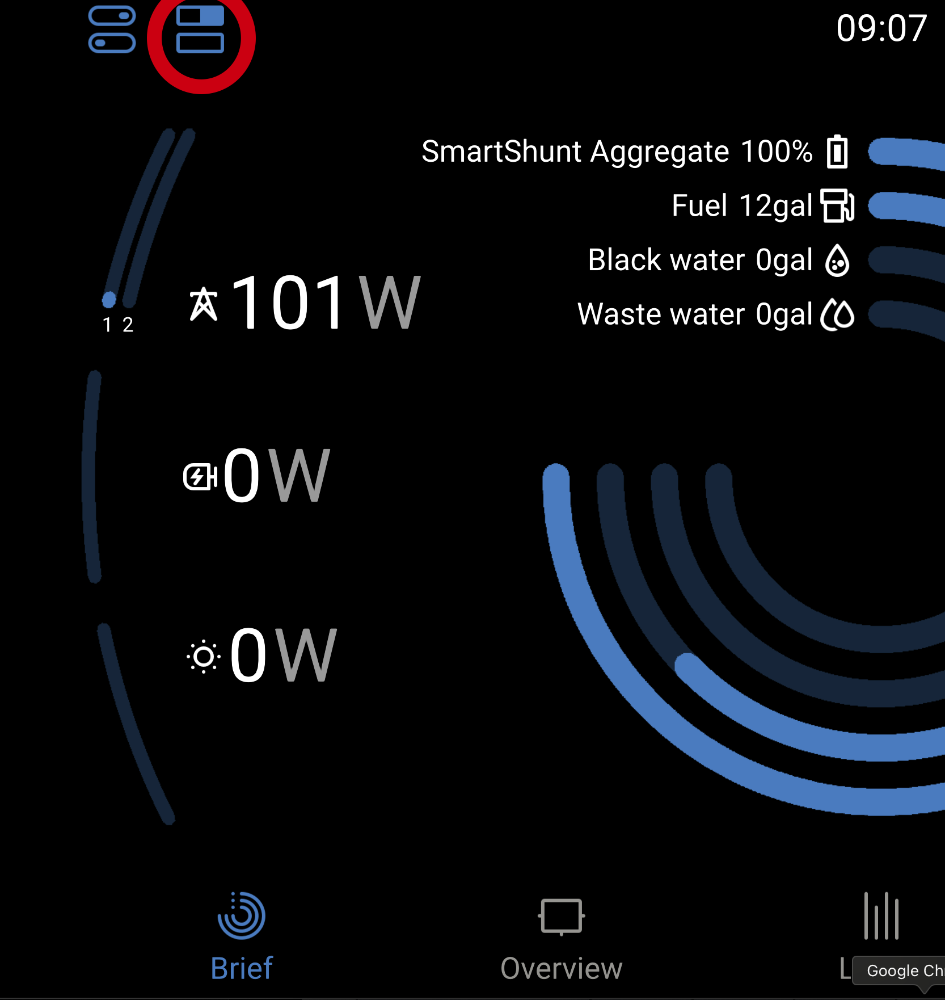
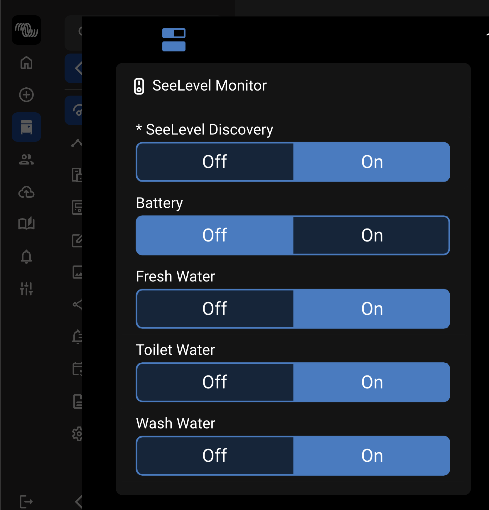
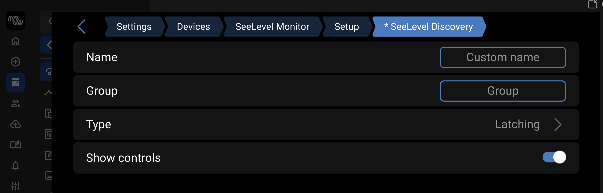

# victron-seelevel-python

Python-based Bluetooth integration for SeeLevel 709-BT sensors on Victron Venus OS. Interactive discovery tool and DBus service for monitoring RV tank levels, temperatures, and battery voltage on Cerbo GX devices.

> **📡 Requires `dbus-ble-advertisements` router service** - This version uses centralized BLE management. For standalone operation, see the `legacy-standalone-btmon` branch.

> **Note**: This Python implementation was created as a workaround for users who cannot build the C version. If [Pull Request #11](https://github.com/victronenergy/dbus-ble-sensors/pull/11) (addressing [Issue #1508](https://github.com/victronenergy/venus/issues/1508)) is accepted into the official Victron firmware, this package will no longer be needed as native SeeLevel support will be included in Venus OS.

## Overview

This Python implementation provides an alternative to the C daemon while users are waiting for Victron to accept the PR. It features:

- **Automatic Sensor Discovery** - Sensors are automatically discovered from BLE advertisements
- **UI-Based Configuration** - Enable/disable sensors via the Venus OS Switches panel
- **Multi-Process Architecture** - Separate process for each enabled sensor for stability
- **Automatic DBus Integration** - Sensors appear automatically in Victron UI and VRM
- **Persistent Configuration** - Sensor states persist across reboots
- **Daemontools Service** - Auto-start on boot with automatic restart on failure

## Supported Sensors

- **Tank Sensors**: Fresh Water, Waste Water (Black), Gray Water, Galley Water, LPG, Chemical
- **Temperature Sensors**: Up to 4 temperature probes
- **Battery Monitor**: Voltage monitoring

## Project Structure

```
victron-seelevel-python/
├── data/
│   ├── dbus-seelevel-service.py     # Main service daemon (creates switch device)
│   ├── dbus-seelevel-sensor.py      # Individual sensor process
│   └── ble_scanner.py               # BLE scanner interface
├── service/
│   ├── run                          # Daemontools service script
│   └── log/
│       └── run                      # Log management script
├── LICENSE                          # Apache 2.0 license
└── README.md                        # This file
```

## Prerequisites

- Victron Cerbo GX (or other Venus OS device)
- SeeLevel 709-BT sensor system
- SSH access to your Cerbo GX

## Quick Start

### Recommended: One-Line Remote Install

```bash
ssh root@<cerbo-ip> "curl -fsSL https://raw.githubusercontent.com/TechBlueprints/victron-seelevel-python/main/install.sh | bash"
```

The installer will:
- Automatically install dbus-ble-advertisements (required dependency)
- Install git if needed
- Clone or update the repository
- Install or restart the service
- Check discovery status and warn if disabled

### Manual Installation

If you prefer manual installation:

```bash
# SSH into your Cerbo
ssh root@<cerbo-ip>

# Install git (if not already installed)
opkg install git

# Install dbus-ble-advertisements first (required dependency)
curl -fsSL https://raw.githubusercontent.com/TechBlueprints/dbus-ble-advertisements/main/install.sh | bash

# Clone the SeeLevel repository
cd /data/apps
git clone https://github.com/TechBlueprints/victron-seelevel-python.git dbus-seelevel

# Run the service installer
cd dbus-seelevel
bash install-service.sh
```

See the [Detailed Installation Guide](#installation-guide) below for more information.

---

# Installation Guide

## Prerequisites

**⚠️ IMPORTANT: This service requires `dbus-ble-advertisements` to be installed first!**

The one-line installer handles this automatically, but if you're installing manually, install the router service first:

👉 **[Install dbus-ble-advertisements first](https://github.com/TechBlueprints/dbus-ble-advertisements)**

The router service provides centralized BLE management for all Victron BLE services. Without it, this service will not work.

> **Alternative**: If you prefer standalone operation without the router, use the **[legacy-standalone-btmon](https://github.com/TechBlueprints/victron-seelevel-python/tree/legacy-standalone-btmon)** branch instead.

---

## Enable SSH Access

### From the New UI (v3.x)

1. Open the Cerbo GX web interface in your browser
2. Navigate to **Settings → General**
3. Scroll down to **SSH on LAN**
4. Enable SSH access
5. Note: Default login is `root` with no password (or the password you've set)

### From the Old UI (v2.x)

1. Open the Cerbo GX web interface in your browser
2. Navigate to **Settings → General**
3. Find **SSH on LAN** and enable it
4. Note: Default login is `root` with no password (or the password you've set)

### From the Device Screen

1. On the Cerbo GX screen, go to **Settings**
2. Select **General**
3. Find **SSH on LAN** and enable it

---

## Detailed Installation Information

### File Locations

- **Installation Directory**: `/data/apps/victron-seelevel-python/`
- **Scripts**: `/data/apps/victron-seelevel-python/data/dbus-seelevel-*.py`
- **Service Directory**: `/data/apps/victron-seelevel-python/service/`
- **Service Symlink**: `/service/dbus-seelevel/` (created via `/data/rc.local` on boot)
- **Persistence**: `/data/rc.local` (ensures symlink is recreated after reboot)
- **Logs**: `/var/log/dbus-seelevel/`
- **Settings**: Stored in `/data/apps/victron-seelevel-python/data/sensors.json` and on D-Bus switch object paths

## Configuration

Sensors are automatically discovered from BLE advertisements and configured via the Venus OS GUI.

### Enabling/Disabling Sensors

To access the sensor control switches on your Cerbo GX:

1. From the main screen, tap the **square toggle icon** (top left corner)
2. This opens the Settings pane showing all available switches

> **Don't see switches?** See the [Switches Not Visible](#switches-not-visible) troubleshooting section.



*The square toggle icon (top left, circled in red) opens the Settings pane where you can control all switches including SeeLevel sensors.*

In the Settings pane, you'll find the **SeeLevel Sensor Control** switches to manage your sensors:



*SeeLevel Sensor Control showing discovered sensors. Each sensor can be individually enabled or disabled.*

**Key features:**
- **Individual sensor control** - Enable/disable Fresh Water, Black Water, Gray Water, Temperature, and Battery sensors
- **Persistent settings** - Sensor states are saved and persist across reboots
- **MAC address identification** - Each sensor shows its source MAC address for easy identification
- **Easy access** - Tap the square toggle icon (top left) to open the Settings pane

**To enable/disable sensors:**
1. Tap the **square toggle icon** in the top left corner of the main screen
2. Scroll to find the **SeeLevel Sensor Control** switches
3. Toggle individual sensors on/off as needed

**Default States:**
- **Tank sensors**: Enabled by default
- **Temperature sensors**: Enabled by default
- **Battery monitor**: Disabled by default

### How to Re-enable Hidden Sensors

If a sensor toggle has been hidden from the UI, you can re-enable it:

1. Tap the **square toggle icon** (top left) to open the Settings pane
2. Find the **SeeLevel Sensor Control** switches
3. Tap the **gear/settings icon** on the sensor you want to make visible
4. Enable **"Show controls"**



*The settings page for a SeeLevel sensor. Enable "Show controls" to make the sensor toggle visible in the main switches screen.*

Once enabled, the sensor toggle will be visible in the main switches screen, allowing you to enable or disable data collection for that specific sensor.

**Note:** This same process applies to all switch-based services including BLE Router and SmartShunt Aggregator.

### Sensor Discovery

Sensors are automatically discovered when:
1. The `dbus-ble-advertisements` router detects a SeeLevel device
2. The router has "BLE Router New Device Discovery" enabled
3. The SeeLevel MAC address is enabled in the router's switches

Once discovered, sensors persist across reboots and can be individually enabled/disabled via the Switches panel.

### Persistent Storage

Sensor configurations and metadata are stored in:
- **Device settings**: `com.victronenergy.settings` at `/Settings/Devices/seelevel/` for device registration (ClassAndVrmInstance, CustomName)
- **Sensor metadata**: JSON file at `/data/apps/victron-seelevel-python/sensors.json` for dynamically discovered sensor information (MAC, TypeID, Num, Name, Type, RelayID, Enabled)

The JSON file is automatically managed by the service and persists across reboots. No manual editing required.

## Service Management

The service uses daemontools/supervise for management:

- **Check status**: `svstat /service/dbus-seelevel`
- **Stop service**: `svc -d /service/dbus-seelevel`
- **Start service**: `svc -u /service/dbus-seelevel`
- **Restart service**: `svc -t /service/dbus-seelevel`
- **View logs**: `tail -f /var/log/dbus-seelevel/current`

The service will:
- ✅ Start automatically on boot
- ✅ Auto-restart if it crashes
- ✅ Run continuously in the background
- ✅ Rotate logs automatically (4 files, 25KB each)

## Disable / Uninstall

To completely disable the service and clean up all settings:

```bash
bash /data/apps/victron-seelevel-python/disable.sh
```

This will:
- Stop the service
- Remove the service from startup (rc.local)
- Clean up all D-Bus settings (including old seelevel_monitor paths)

To fully remove, also delete the install directory:
```bash
rm -rf /data/apps/victron-seelevel-python
rm -rf /data/apps/dbus-seelevel  # if old install exists
```

## Troubleshooting

### Switches Not Visible

#### If the square toggle icon doesn't appear at all on the main screen:

This means no switches are currently enabled on your system. **For initial setup, you need to enable BOTH BLE Router discovery AND SeeLevel Tank discovery.**

**Step 1: Access the Device List**
1. From the main screen, tap the **round toggle icon** (top left corner, next to where the square one would be)
2. This opens the device list showing all DBus devices
3. Scroll down to find **"BLE Router"** device

**Step 2: Enable BLE Router Discovery**
1. Tap on the **BLE Router** device
2. Find the setting **"BLE Router New Device Discovery"**
3. Toggle it **ON** (this enables BLE scanning)

**Step 3: Enable SeeLevel Tank Discovery**
1. In the device list, find **"SeeLevel Monitor"** device
2. Tap on it to open settings
3. Find **"SeeLevel Tank Discovery"** 
4. Toggle it **ON** (this allows tank sensors to be discovered)

**Step 4: Wait for Discovery**
1. Wait 30-60 seconds for your SeeLevel device to be discovered
2. Once discovered, sensor switches will appear in the device list
3. The **square toggle icon** should now appear on the main screen

**Step 5: Disable Discovery (Optional)**
- After initial setup, you can disable both discovery switches to save resources
- Discovered sensors persist across reboots

> **⚠️ Important:** BOTH discoveries must be enabled for initial setup:
> - **BLE Router New Device Discovery** - allows the router to scan for BLE devices
> - **SeeLevel Tank Discovery** - allows the SeeLevel service to create sensors from discovered devices

#### If the Settings pane opens but SeeLevel switches aren't visible:

Switches may be hidden ("Show controls" disabled) or sensors haven't been discovered yet.

**Option 1: Re-enable Hidden Switches**
1. Tap the **round toggle icon** to open the device list
2. Find **"SeeLevel Monitor"** or individual sensor devices
3. Tap on each sensor
4. Enable **"Show controls"** to make the toggle visible

**Option 2: Enable Discovery**
1. Check that both discoveries are enabled (see steps above)
2. Wait for sensors to be discovered
3. Check logs: `tail -f /var/log/dbus-seelevel/current`

### Sensors Not Appearing in UI

If your SeeLevel tanks are not showing up in the Venus OS UI, use the diagnostic script for a complete system check:

#### **Quick Diagnostic (Recommended)**

```bash
# Run the diagnostic script
bash /data/apps/victron-seelevel-python/diagnose.sh
```

This script automatically checks:
- ✓ Both services are running
- ✓ Both discovery switches are enabled
- ✓ Manufacturer IDs are registered correctly
- ✓ Sensors have been discovered
- ✓ BLE advertisements are being received
- ✓ D-Bus services are registered
- ✓ Sensor processes are active

The script will provide color-coded results and specific fix commands for any issues found.

---

#### **Manual Diagnostic Steps**

If you prefer to check manually, follow these steps:

#### **Step 1: Verify Both Services Are Running**

```bash
# Check BLE Router service (should show "up"):
svstat /service/dbus-ble-advertisements

# Check SeeLevel service (should show "up"):
svstat /service/dbus-seelevel
```

If either shows `down`, start it:
```bash
svc -u /service/dbus-ble-advertisements
svc -u /service/dbus-seelevel
```

#### **Step 2: Check Discovery Switches Are Enabled**

**BOTH discoveries must be enabled for sensors to appear:**

```bash
# Check BLE Router discovery (should return 1):
dbus -y com.victronenergy.switch.ble_advertisements /SwitchableOutput/relay_discovery/State GetValue

# Check SeeLevel Tank discovery (should return 1):
dbus -y com.victronenergy.switch.seelevel /SwitchableOutput/relay_discovery/State GetValue
```

If either returns `0`, enable them:
```bash
# Enable BLE Router discovery:
dbus -y com.victronenergy.switch.ble_advertisements /SwitchableOutput/relay_discovery/State SetValue %1

# Enable SeeLevel Tank discovery:
dbus -y com.victronenergy.switch.seelevel /SwitchableOutput/relay_discovery/State SetValue %1
```

**Via GUI:**
1. Tap the **round toggle icon** (top left) to open device list
2. Find and tap **"BLE Router"** → Enable **"BLE Router New Device Discovery"**
3. Find and tap **"SeeLevel Monitor"** → Enable **"* SeeLevel Discovery"**

#### **Step 3: Verify Your Device is Broadcasting**

Check if btmon sees your SeeLevel device:
```bash
btmon | grep -i "709-BT"
```

You should see BLE advertisements within 30-60 seconds. Press Ctrl+C to stop.

#### **Step 4: Check BLE Router is Receiving Advertisements**

```bash
tail -f /var/log/dbus-ble-advertisements/current
```

Look for lines mentioning your device's MAC address or manufacturer ID 305 (Cypress) or 3264 (SeeLevel).

#### **Step 5: Check SeeLevel Service is Receiving Advertisements**

```bash
tail -f /var/log/dbus-seelevel/current
```

You should see:
```
Advertisement received: BTP3/CYPRESS from XX:XX:XX:XX:XX:XX
Discovered sensor: Fresh Water (XX:XX:XX:XX:XX:XX)
Created switch for sensor: Fresh Water (XX:XX:XX:XX:XX:XX)
```

If you see "Advertisement received" but no "Discovered sensor", the discovery switch might be disabled.

#### **Step 6: Check Device MAC is Enabled in BLE Router**

Even if discoveries are enabled, individual device toggles might be disabled:

**Via GUI:**
1. Tap **square toggle icon** (top left) to open Settings pane
2. Find **BLE Router** switches
3. Look for your device's MAC address toggle and enable it

**Via logs:**
```bash
# Check discovered devices
dbus-send --system --print-reply \
  --dest=com.victronenergy.switch.ble_advertisements \
  /ble_advertisements \
  org.freedesktop.DBus.Introspectable.Introspect | grep "relay_"
```

#### **Quick Diagnostic Script**

Save this as `check-seelevel.sh` and run it:

```bash
#!/bin/bash
echo "=== SeeLevel Diagnostic Check ==="
echo ""
echo "1. Services:"
svstat /service/dbus-ble-advertisements
svstat /service/dbus-seelevel
echo ""
echo "2. Discovery Switches (both should be 1):"
echo -n "   BLE Router: "
dbus -y com.victronenergy.switch.ble_advertisements /SwitchableOutput/relay_discovery/State GetValue 2>/dev/null || echo "ERROR"
echo -n "   SeeLevel:   "
dbus -y com.victronenergy.switch.seelevel /SwitchableOutput/relay_discovery/State GetValue 2>/dev/null || echo "ERROR"
echo ""
echo "3. Recent SeeLevel logs:"
tail -n 20 /var/log/dbus-seelevel/current 2>/dev/null | grep -E "(Advertisement|Discovered|ERROR)" || echo "   No relevant logs found"
echo ""
echo "=== End Diagnostic ==="
```

Run with: `bash check-seelevel.sh`

### Sensors Discovered But Not Showing Data

1. Check that the sensor is enabled: Tap the square toggle icon (top left) and find **SeeLevel Sensor Control**
2. Check the logs for errors: `tail -f /var/log/dbus-seelevel/current`
3. Verify the sensor process is running: `ps | grep dbus-seelevel-sensor`

### Service Won't Start

1. Check the run script is executable: `ls -la /service/dbus-seelevel/run`
2. Check for Python errors: `tail -f /var/log/dbus-seelevel/current`
3. Verify scripts exist: `ls -la /data/apps/victron-seelevel-python/data/dbus-seelevel-*.py`
4. Test manually: `python3 /data/apps/victron-seelevel-python/data/dbus-seelevel-service.py`

### Resetting Sensor Configuration

To reset all discovered sensors and start fresh:

```bash
rm /data/apps/victron-seelevel-python/sensors.json
svc -t /service/dbus-seelevel
```

Sensors will be re-discovered automatically when BLE advertisements are received.

## Uninstallation

To remove the service:

```bash
# Stop the service
svc -d /service/dbus-seelevel

# Remove the service directory
rm -rf /service/dbus-seelevel

# Remove the scripts (optional)
rm -f /data/apps/victron-seelevel-python/data/dbus-seelevel-*.py

# Remove the logs (optional)
rm -rf /var/log/dbus-seelevel
```

## Support

For issues or questions:
- Check the logs: `/var/log/dbus-seelevel/current`
- Verify Bluetooth is working on your Cerbo GX
- Ensure your SeeLevel 709-BT is powered on and broadcasting
- Confirm `dbus-ble-advertisements` router is running

---

# Technical Reference

## SeeLevel 709-BT Specification

The Garnet 709-BT hardware supports Bluetooth Low Energy (BLE), and is configured as a Broadcaster transmitting advertisement packets. It continuously cycles through its connected sensors sending out sensor data. No BLE connection is required to read the data.

### BLE Packet Formats

**Manufacturer ID**: 305 (0x0131) - Cypress Semiconductor

**Payload** (14 bytes):
- **Bytes 0-2**: Coach ID (24-bit unique hardware ID, little-endian)
- **Byte 3**: Sensor Number (0-13)
- **Bytes 4-6**: Sensor Data (3 ASCII characters)
- **Bytes 7-9**: Sensor Volume (3 ASCII characters, gallons)
- **Bytes 10-12**: Sensor Total (3 ASCII characters, gallons)
- **Byte 13**: Sensor Alarm (ASCII digit '0'-'9')

**Manufacturer ID**: 3264 (0x0CC0) - Seelevel (used in newer BTP7 device)

**Payload** (14 bytes):
- **Bytes 0-2**: Coach ID (24-bit unique hardware ID, little-endian)
- **Byte 3-10**: Tank Level / State in the following order:
	- Fresh1, Grey1, Black1, Fresh2, Grey2, Black2, Grey3, LPG, 1 byte per tank.
	- 0 - 100 indicates level, values above 100 are tank exceptions:
		- **101**: Short Circuit
		- **102**: Open / No response
		- **103**: Bitcount error
		- **104**: Configured as non stacked but received stacked data
		- **105**: Stacked, missing bottom sender data
		- **106**: Stacked, missing top sender data
		- **108**: Bad Checksum
		- **110**: Tank disabled
		- **111**: Tank init 

### Sensor Numbers

| Number | Sensor Type (0x0131)| Sensor Type (0x0CC0) |
|--------|---------------------|----------------------|
| 0 | Fresh Water | Fresh Water |
| 1 | Black Water  | Gray Water |
| 2 | Gray Water | Black Water |
| 3 | LPG | Fresh Water 2|
| 4 | LPG 2 | Gray Water 2|
| 5 | Galley Water | Black Water 2|
| 6 | Galley Water 2 | Gray Water 3|
| 7 | Temperature | LPG |
| 8 | Temperature 2 | Battery (voltage × 10)|
| 9 | Temperature 3 | - |
| 10 | Temperature 4 | - |
| 11 | Chemical | - |
| 12 | Chemical 2 | - |
| 13 | Battery (voltage × 10) | - |

### Status Codes

For the Cypress (0x0131) version, in the Sensor Data field (bytes 4-6):
- **"OPN"**: Sensor open/disconnected (device not created)
- **"ERR"**: Sensor error (device shown with error status)
- **Numeric**: Actual sensor reading

For the newer 0x0CC0 version, values above 100 for tank sensors are exceptions:
- **101**: Short Circuit
- **102**: Open / No response
- **103**: Bitcount error
- **104**: Configured as non stacked but received stacked data
- **105**: Stacked, missing bottom sender data
- **106**: Stacked, missing top sender data
- **108**: Bad Checksum
- **110**: Tank disabled
- **111**: Tank init 

### Unit Conversions

- **Tank Volume/Capacity**: Gallons × 0.00378541 = m³
- **Temperature**: (°F - 32) × 5/9 = °C
- **Battery Voltage**: Value ÷ 10 = Volts
- **Tank Level**: Direct percentage (0-100)

### Victron DBus Mappings

**Product IDs**:
- Tank Sensor: `0xA142` (VE_PROD_ID_TANK_SENSOR)
- Temperature Sensor: `0xA143` (VE_PROD_ID_TEMPERATURE_SENSOR)
- Battery Monitor: `0xA381` (VE_PROD_ID_BATTERY_MONITOR)

**Fluid Types**:
- Fresh Water: `1` (FLUID_TYPE_FRESH_WATER)
- Waste Water: `2` (FLUID_TYPE_WASTE_WATER)
- Black Water: `5` (FLUID_TYPE_BLACK_WATER)
- LPG: `8` (FLUID_TYPE_LPG)
- Chemical: `0` (Custom)

**Note**: Sensor 1 (Black Water) is displayed as "Waste Water" but uses `FLUID_TYPE_BLACK_WATER` (5) for Victron compatibility.

---

## License

Copyright 2025 Clint Goudie-Nice

Licensed under the Apache License, Version 2.0 (the "License");
you may not use this file except in compliance with the License.
You may obtain a copy of the License at

    http://www.apache.org/licenses/LICENSE-2.0

Unless required by applicable law or agreed to in writing, software
distributed under the License is distributed on an "AS IS" BASIS,
WITHOUT WARRANTIES OR CONDITIONS OF ANY KIND, either express or implied.
See the License for the specific language governing permissions and
limitations under the License.
